Hi, I'm Jeel — an Applied AI student who ships things instead of leaving them in a notebook. At a steel manufacturer, I trained a YOLO model that cut a full 8-hour manual counting shift down to about 10 minutes at 97.53% accuracy, and built Copilot Studio agents that turned a 59-minute workflow into a 1-minute one for a dozen colleagues. Give me messy factory data, a camera pointed at something hard to read, or a workflow nobody enjoys doing by hand, and I'll come back with a trained model, a CLI or API around it, and a Docker image to run it. I work comfortably in German and English.

Outside the day job I led a 4-person team building a clinical decision-support backend for LMU Klinikum on top of a locally hosted LLM (FastAPI, Ollama/Mistral, 238 tests), and I currently do voluntary edge-AI research at TH Rosenheim, benchmarking model architectures and microcontrollers for on-device image classification.

## Thought of the day

## Selected work

| Project | What it does |
| :--- | :--- |
| [billet-stamp-OCR](https://github.com/jeelsidpara2811/billet-stamp-OCR) | Reads stamped ID numbers off steel billets — classical OpenCV + Tesseract OCR on a real factory floor |
| [shoe-recognition-jeel-project](https://github.com/jeelsidpara2811/shoe-recognition-jeel-project) | CLIP-based visual search: give it a photo, it finds look-alike shoes from a gallery |
| [Clustering_project_jeel](https://github.com/jeelsidpara2811/Clustering_project_jeel) | Benchmarks K-Means, Agglomerative, and DBSCAN to segment customers by behavior |
| [stock-api-jeel-project](https://github.com/jeelsidpara2811/stock-api-jeel-project) | A Dockerized FastAPI service serving live stock data behind three REST endpoints |

Off the data-science path, two builds I keep around: [LiFi-Based-Transmission](https://github.com/jeelsidpara2811/LiFi-Based-Transmission), a two-Arduino Li-Fi link that sends text through an LED bulb and decodes it with a solar panel, and [weather-data-app-jeel](https://github.com/jeelsidpara2811/weather-data-app-jeel), a Java OOP exercise that generates a static weather site.

## Toolbox

Python for everything. Scikit-learn and XGBoost when the data is tabular, PyTorch/YOLO and OpenCV when it's pixels, LangChain/Ollama when it's an LLM, FastAPI and Docker when it needs to ship.

## Obligatory snake

<picture>
  <source media="(prefers-color-scheme: dark)" srcset="https://raw.githubusercontent.com/jeelsidpara2811/jeelsidpara2811/output/github-contribution-grid-snake-dark.svg">
  
</picture>

Regenerated every night by GitHub Actions.

